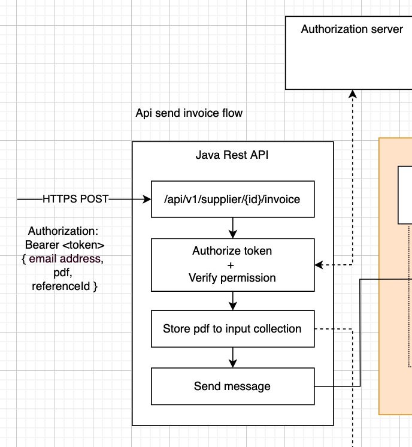
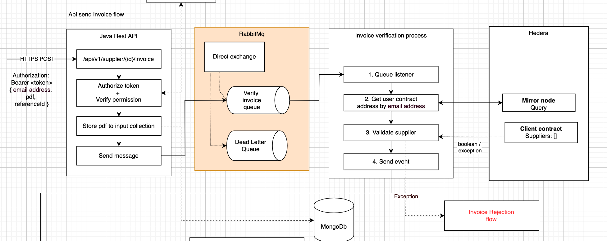

===========
Invoice api
===========

REST API
--------
Suppliers should send their invoices as https POST multipart requests.
The request should contain the PDF they want to publish, along with a POST body containing meta data.
I.e. the client email address they want to send the invoice to, and possibly a company-specific internal invoice referenceId.
The supplier should send a bearer token in the request’s Authorization header;
this is the access token that they obtained during login, and that was provided by our Authorization server following the oAuth2 token flow.

Token format
------------
Although opaque tokens would have preference (they don’t expose information embedded in the token), it requires a round trip to the Authorization server for every incoming request.
It is more performant to use JWT’s, which can be parsed locally at the resource server (see oAuth2 architecture) without requiring a remote HTTP call.
It could in theory be possible to encrypt the token to hide the data it contains, but there isn’t really need for this since the JWT won’t contain any secret identity information.
The only thing that matters is that the JWT hasn’t been forged /

Client SDK
----------
Following the oAuth2 flow, access tokens are generally limited in time.
Since we want our flow to comply to the maximum security guidelines, we respect brief expiration times.
This also means that the clients need to implement the oAuth2 refresh token flow to request new access token regularly.
It is generally known that this is quite the hassle, therefore we provide a client SDK that eases the interaction with our API.

.. warning::

    The design of the client sdk needs to be analyzed.

.. info::

    Aside from a client SDK, we will offer suppliers the possibility to upload invoices through our web interface.

Store input invoices
--------------------
All pdf’s that enter the system are immediately stored in a collection as encrypted binaries.
We use a two-way encryption, since the pdf’s need to be decrypted when the user wants to view or download them.
One reason is that it is better not to send full PDF documents as binaries through Rabbit queues because of their message size.
It is better to store all documents in persistent storage, while sending meta data about the stored document through the queue.
This requires less bytes to be transferred and instead allows for lightweight messaging.

Another reason is that not all PDF’s will be validated positively.
We keep track of all PDF’s that entered the system in order to handle rejected invoices gracefully based on the reason of rejection.

.. warning::

    To be decided if we need to generate proofs for all input documents (I think the answer is yes).

RabbitMq
--------

To manage high loads of POST requests, we are required to use a queueing system like RabbitMQ (AMQP protocol) to handle back pressure (data buffering between processes).
Although the REST api that we expose uses multithreading, it is insufficient on its own under high pressure.
The number of rabbit listeners can be configured in Java to allow parallel processing.

.. note::

    Although our system would benefit from using a reactive API, Java SDK19 comes with the loom Project that supports Virtual Threads in Preview mode.
    At least initially it is fine to write code in blocking fashion, and use Virtual Threads once they're ready to use in Production.

Bulk uploads
------------

We define 3 request types that can be sent to our api, categorised by the heaviness of the load (low, average, high).
The lowest request type involves a manual / low number of expected requests, whereas the highest involves bulk / mass uploads.

.. note::

    Initially we will focus on the manual upload implementation first, as contains the easiest architecture.
    We will gather metrics, and can decide later whether bulk uploads are worth it.

We enforce limitations on the load by implementing a rate limiter.

.. warning::

    Further measures will be taken to ensure that the number of requests can be controlled.
    If we were to upscale in order to perform mass uploads, it is important to ensure that uploads from one supplier don't impact the performance of another.
    To be determined later.

