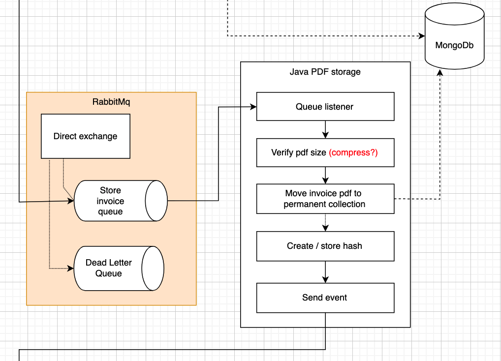
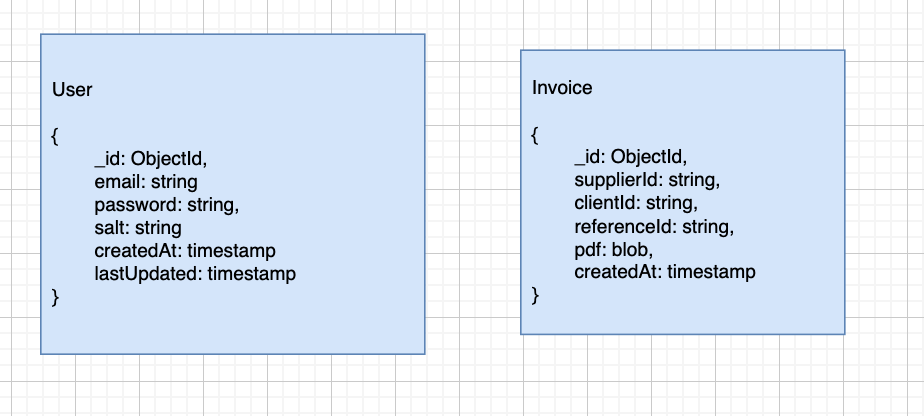

===============
Invoice storage
===============

Before storing the PDF, we verify if the pdf size is acceptable (eg. 100Kb), and may apply compression if necessary.

.. warning::

    Compression degrades the PDF quality.
    The easy solution is just to reject PDF’s that are too large which comes with its own downsides for suppliers.
    To be decided.

Theoretically it is possible to store invoices as embedded documents within User documents.
In our case we store them in a separate collection because we will generate and store proofs on Hedera for each invoice separately.
When the user wants to view / download an invoice, the hash will be verified.

.. warning::

    To be decided whether or not we will use GridFs to store the documents.
    MongoDb allows storing files directly in a document up to 16MB, which is plenty for our use case.
    The trade off between the two has yet to be determined.
