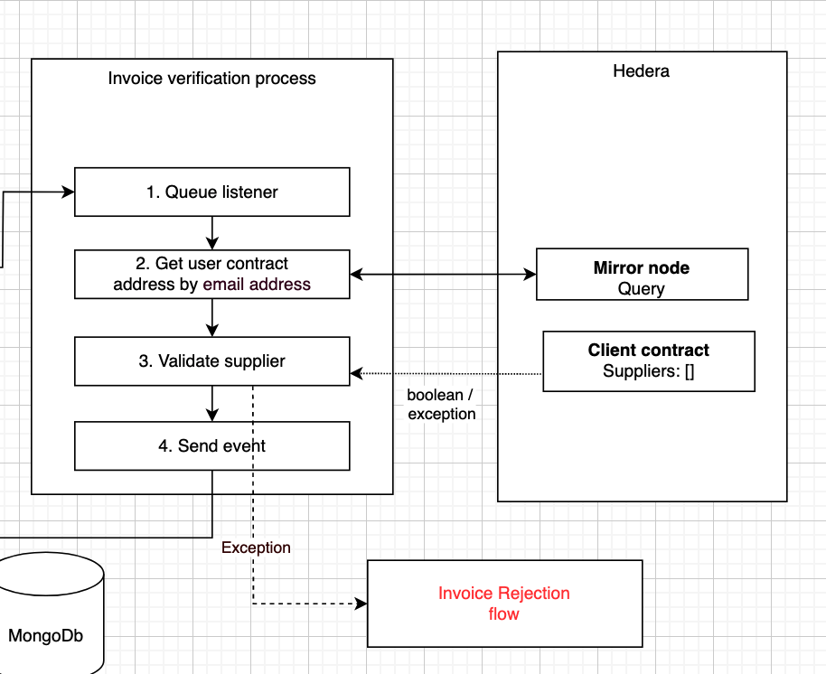

====================
Invoice verification
====================

Find client user smart contract
-------------------------------

Based on the the email address of the client user (the receiver of the invoice), we query the Hedera network using an HTTP call to their mirror nodes in order to find their client smart contract address: https://testnet.mirrornode.hedera.com/api/v1/
Hedera mirror nodes are read-only nodes; they get populated with data from the main nodes through a gossiping protocol, in order to improve the performance quality of the Hedera network.

.. warning::

    We should consider the time it takes for mirror nodes to be populated from the main nodes.
    If an invoice is sent while the user smart contract doesn't exist yet, then it means the verification can't be done.
    This can be solved by storing these invoices in a dedicated collection to be processed by a scheduler at a later time.

Validate supplier
-----------------
We verify if the supplier has been whitelisted by the client user by making a call to their smart contract.
Reading from the smart contract doesn’t require a user’s private key, nor does it cost transaction fee.
If the supplier was not found, then the message should be sent to an exception queue, to gracefully handle requests that were declined.

.. warning::

    We should consider what to do with clients that don’t have a smart contract.
    Did something go wrong during contract creation?
    Should we send an email to receivers that haven’t registered with our application as promotion?

.. warning::

    We should consider what to do with invoices that get rejected.
    Should we inform the supplier of rejected invoices?
    As discussed, if a user doesn't have an account yet, we will still send them an email with different template.
