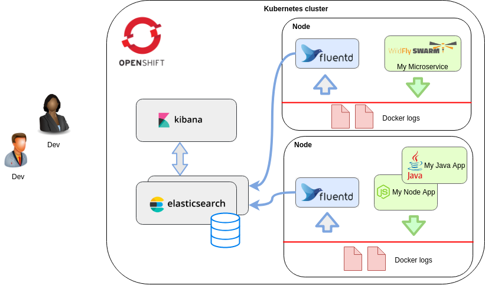

=======
Logging
=======

For logging, the EFK (or ELK) stack is a common tool for professional log analysis.
Since microservices are run in a distributed environment, we use a centralised logging system.

EFK (ElasticSearch - FluentD - Kibana) is used to store log messages in an ElasticSearch database (based on Apache Lucene, performing full text query searches), while Kibana can be used to visualising logs.

FluentD is a log collector that listens to aggregated application log streams (from different applications), and can be configured (among others) as a whitelist for filtering logs based on string patterns.

