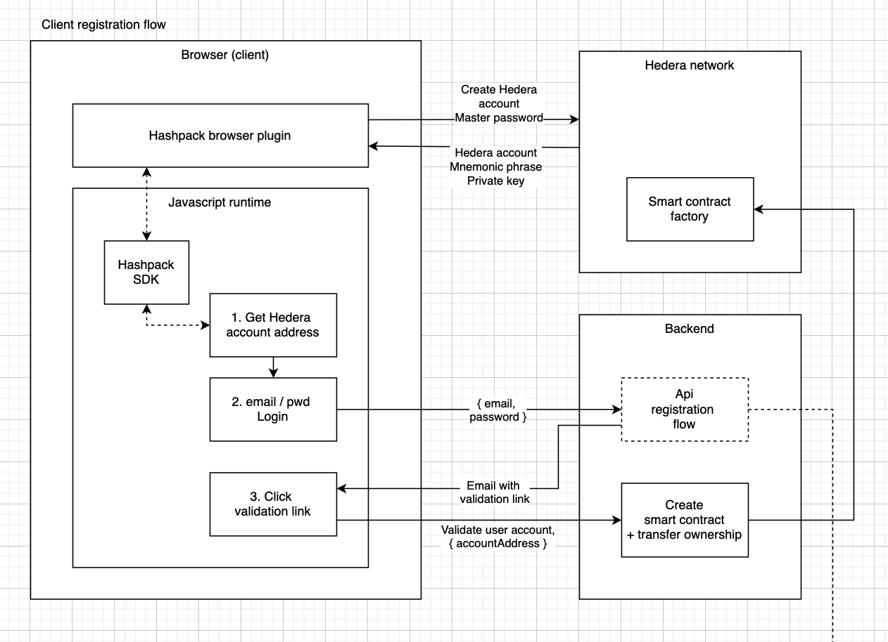
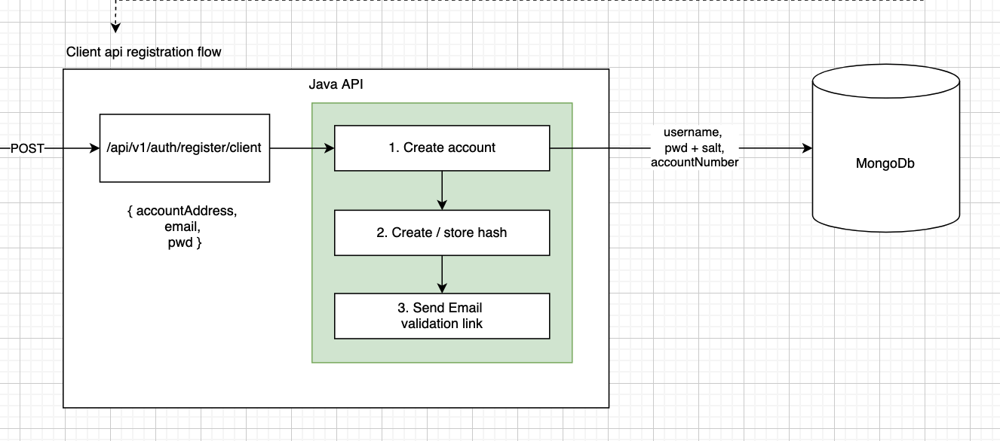

========================
Client registration flow
========================

Hedera account
--------------

The first thing users need to do is to create a Hedera account through the Hashpack browser plugin.
It is much better to create the Hedera account from the client rather than from our server, because the user’s private credentials (master password, private key, mnemonic phrase) are never exposed outside of the user’s local machine.
The procedure for registering a Hedera account can be found here: https://www.hashpack.app/post/how-to- create-your-first-account-with-hashpack.

All interactions between client and the Hedera network should be unique handled from the client without passing through an intermediary central server.

Register website account
------------------------

Only after the user has created a Hedera account, (s)he will be able to register an account to our website.

.. warning::

    Consider allowing Google / LinkedIn etc, given that the user allows “email” permission

The preliminary creation of a Hedera account is necessary first, because our backend needs the user’s account address for transferring ownership of the user’s smart contract after the email address was validated.
In the backend we store the user password encrypted with a slow hashing algorithm (bcrypt), and an additional salt that is included in the hash to prevent easy recognition of duplicate passwords in the database.
The password that we store is merely useful for logging in into our website to visit user specific content and downloading invoices.
In no way does it expose the Hashpack master password that is used for configuring the whitelist configuration of suppliers, since this is done through a direction connection from the client to the Hedera smart contract.
The login flow to our website follows the general oAuth2.0 flow. Even in the very unlikely event that the user’s access token gets stolen during a brief time window, the smart contract’s ownership is safe.

Backend registration flow
-------------------------

The registration flow in the backend follows a standard flow:

